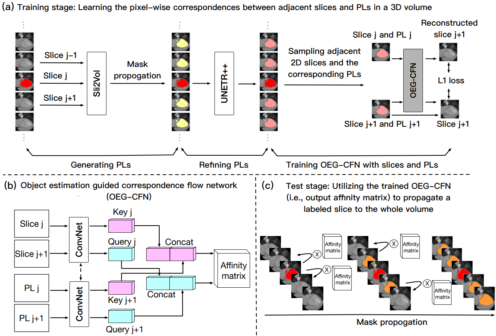
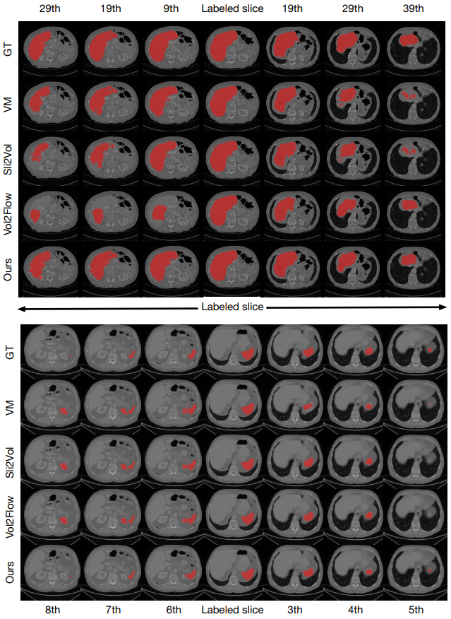

# Sli2Vol+: Segmenting 3D Medical Images Based on an Object Estimation Guided Correspondence Flow Network

[Delin An](https://github.com/adlsn)<sup>1</sup>, [Pengfei Gu]<sup>2</sup>, [Milan Sonka]()<sup>3</sup>, [Chaoli Wang](https://sites.nd.edu/chaoli-wang/)<sup>1</sup>, and [Danny Z. Chen]()<sup>1</sup>

University of Notre Dame<sup>1</sup>, The University of Texas Rio Grande Valley<sup>2</sup>, University of Iowa<sup>3</sup>

<div>
  
</div>

## Introduction
> Sli2Vol+ builds upon the Sli2Vol framework, further advancing self-supervised approaches for 3D medical image segmentation with minimal annotations. By utilizing pseudo-label propagation and introducing a novel Object Estimation Guided Correspondence Flow Network, Sli2Vol+ addresses key challenges such as error accumulation during inter-slice propagation and discontinuities between consecutive slices. This enables accurate segmentation of anatomical structures in 3D medical images using only a single annotated slice per volume, achieving superior generalizability across diverse datasets, organs, and imaging modalities.
---

## Qualitative Comparison
---

> The qualitative results provide a comprehensive comparison of our method with other approaches, particularly in scenarios involving propagation to slices distant from the labeled slice. These results highlight the effectiveness of our method in mitigating error accumulation during propagation, as evidenced by the improved segmentation accuracy on the 29th and 39th slices. Additionally, our method demonstrates exceptional robustness in addressing object discontinuities, successfully segmenting slices where objects terminate between consecutive frames (e.g., from the 7th to 8th slices in the spleen dataset). In contrast, other mask propagation methods often produce false positives in such cases, further emphasizing the reliability and precision of our approach.

<div>
  
</div>

## Installation, Training, and Testing
The code is developed by Python. After cloning the repository, follow the steps below for installation:
1. Create and activate the conda environment
```python
conda create --name sliplus python=3.10
conda activate sliplus
```
2. Install dependencies
```python
pip install -r requirements.txt
```
3. Training
```python
python train.py
```

4. Testing
```python
python test.py
```

## Dependencies
* Python (3.6), other versions should also work
* PyTorch (1.6), other versions should also work

## Acknowledgement
This repository is built based on [Sli2Vol](https://github.com/pakheiyeung/Sli2Vol) repository.


